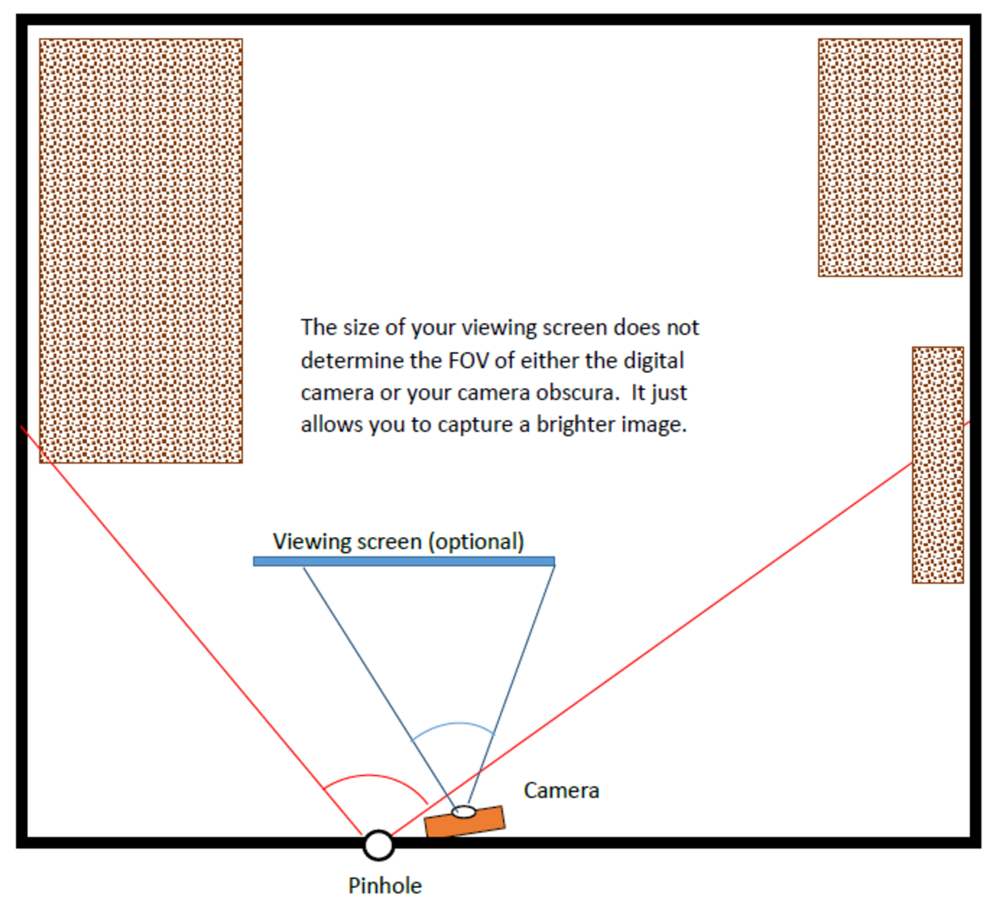

# Camera Obscura

## Synopsis

In this assignment, you will construct a Camera Obscura (also known as a pin-hole camera), and document the construction and operation of the camera. The camera obscura is the forerunner of modern cameras, as shown in this [drawing of the Arabic scientist Al-Hasan in the 10th century](https://padumedu.files.wordpress.com/2013/12/alhazen.jpg) and in this [17th century manuscript](https://upload.wikimedia.org/wikipedia/commons/8/8a/Camera_obscura2.jpg). The best way to learn about this first primitive camera and understand how it serves as a basic model of all cameras is to experience it yourself. 

To help you with this assignment, you should watch Lesson 3:
  - Module 03-01: Cameras
  - Module 03-02: Lenses
  - Module 03-03: Exposure
  - Module 03-04: Sensor

#### General Advice

  - You really want your outside scene to be well lit by the sun as you're working on the assignment. We recommend that you look up your local weather forecast and plan! It may take a couple days to get things really right as you build your obscura. Excuses that blame the weather are not acceptable. Remember that there are no extensions granted in this course. Exceptions are made on rare occasions - see Course Syllabus for more information. 
  - **Take all of your pictures in Landscape mode (width > height).** Smartphones held sideways, SLRs in normal position. This supports your report, more info below and in the report template.
  - Choose a room that will be easy to darken, with few windows. Use a relatively small pinhole (ranging from ⅛” to coin sized, depending on room size).
  - Control the light entering the room. (**Heavy** black plastic, blankets, aluminum foil, and cardboard are frequently used.)
  - Be careful with your walls! Use blue or green painters. Do not use duct tape. It pulls paint off of walls. Also, duct tape lets a lot of light in (surprise!). 
  - If your walls have dark paint, or the image is very dim, use sheets, or improvise a white screen closer to the pinhole to reveal the image.
  - If your room or camera absolutely won't work for this task, you can try to borrow a camera or room from a friend or family member.
  - Thin, stiff materials make better pinholes. Beverage cans work for this, among many other materials.
  - Experiment with different pinhole diameters (this is a requirement), especially if the image is really dim. 
  - Keep your camera still during the entire exposure time (use a tripod or other support). Use your camera’s timer to help - a delay gives you time to set the camera and turn off room lights, and removes a source of motion.
  - You may do some editing/enhancement to brighten the image or flip it, but keep notes on the procedure you followed to take the final image and make sure you discuss it in your report. You will need to show the original image; so edit a copy.
  - Smartphones have difficulties taking long exposure images. Students have found slow shutter apps that have worked well for them. As apps change constantly, we do not recommend any particular ones, but feel free to discuss with other students on Ed.

#### Examples

  - You can see  a couple examples of scenes, pinholes, and final images previous students took on Canvas at: Files → Other → CS6475_CameraObscuraSamples.pdf. This is NOT a model sample of the report.

  - For discussion of box obscura,and some results see http://www.janetneuhauser.com/thoughts-on-lensless-photography/

Please note there may be differences between these examples and the requirements of this assignment. The examples are meant to highlight the types of images and ways that previous students have been able to capture in relation to this assignment, but please follow the directions in this assignment.

## Instructions

This excellent video gives a good overview of the process you will follow: [Making Your Own Room With a View](https://www.youtube.com/watch?v=gvzpu0Q9RTU)

Regardless of whether you built a room camera obscura or an alternative box camera obscura, you are REQUIRED to perform a pinhole experiment and document your results and observations. **See the report template for instructions on the Pinhole Experiment part of this assignment**. 

### 1. Build a Camera Obscura and Perform a Pinhole Experiment

Convert a room in your house (or a closet, a bay window, or any small enclosed place) into a camera obscura by letting light pass into the room only through a small hole (i.e., the pinhole). Block out all light from windows, doorways, and any other sources, leaving only a small pinhole in one surface. An image of the outside world will be projected onto a wall in your room. The image will be dim but visible to the naked eye (once your eyes acclimate to the darkness) as long as the space is very dark. 

You may get help in building your room camera obscura from a friend or family member, but we expect that you will direct the efforts and document what they did to help. Document your efforts by taking pictures, even for setups that fail. These are lessons learned that you should include in your report.

*NOTE:* It is a good idea to let your neighbors know what you are doing. Covering windows with cardboard and foil has occasionally caused consternation. You may share the class website with them: https://www.omscs.gatech.edu/cs-6475-computational-photography

Really consider your pinhole arrangement. You will need to perform a pinhole experiment where you experiment with multiple pinholes of different dimensions and compare the results, so arrange some way to swap or change pinhole sizes easily. **Read through the report template for more information.**

#### Alternative Box Camera Obscura

You must make a serious attempt to building a camera obscura in a room as described above before building a box camera. People usually get much better results in a room, most box cameras give poor results, and you will need extra care to get good ones. However, if you cannot use a room, then you may construct a box camera. You must explain in your report why you could not build a room and you will not be penalized. 

A box camera obscura can be built using a large cardboard box or other light-proof container. Consider a moving box, paper supply box, or grocery store boxes. If you follow this approach, you will not get the true experience of being inside a camera obscura, but a box can still give very good results. The advantage of this method is portability, so you can make images of a variety of outdoor scenes.

If you choose this approach, investigate how to see the image inside and how to capture a picture of the interior. This is challenging, but there are solutions. In the past, students have achieved good results by taking a picture of the back/side screen of the box with their camera looking through a view-hole cut adjacent to the pinhole -- but the camera location will need light-proofing. Another option is to seal the camera inside the box on a timer or remote control.

If you choose this alternative approach, then make sure that you:

  - Document in your write-up the steps that you took to try the room camera obscura, and/or what prevented you from being successful in using a room for the assignment. This can include lack of suitable location, lighting problems, weather conditions, etc.

  - Make a light-proof box or container (this takes care and effort!). You will need to capture the image projected onto the back of the box with the box closed to prevent light leakage.

  - The image through the pinhole should project onto a solid opaque surface at the back of the box. This means that the light cannot shine through the back of the box. You should place a white screen along the box walls, as images do not show up well on brown cardboard.

  - Perform the pinhole experiment and document your results. Try various pinhole sizes, but start small for boxes. 

  - Capture the building process of your box camera obscura. Take pictures as you go so you can use them in your report.

#### What **NOT** to do (substantial deduction for any of these, you will fail the assignment):

  - Do NOT build a box camera where you take pictures from behind a translucent screen. This design blurs or “fogs” the image considerably, and generally has substantial light leakage. An example of this **FORBIDDEN type of camera:** https://www.youtube.com/watch?v=Y0wenfVfHuo.

  - Do NOT build a pinhole lens for your camera. The simplest way to get a Pinhole Camera for those with a removable lens camera is to just make a small hole in a lens-cover and put it in front of the camera. This IS NOT ACCEPTABLE. The assignment requires a room, or the alternative box/container, where you can make the box into a camera with a screen.

  - Do NOT simply stick the camera through the back of a box camera and photograph the pinhole.

  - Do NOT use a lens for the basic assignment. You may investigate using a lens and compare between pinholes and a lens after using the plain pinhole camera, but you must submit results from a camera obscura with just a pinhole lens.

### 2. Document your work

#### Image Landscape Ratio Requirement
**Take all of your pictures in a 4:3 ratio of Width:Height or more. This is Landscape orientation,** which results in an image that is wide. The report template is set up for wide images, to keep images from moving around on the report. It does not matter to LaTex how large the image is, it will resize to fit the width, retaining the image ratio. If your images are Portrait orientation, you need to crop them to Landscape orientation, using a program such as Photoshop or open-source Gimp, or write your own.

#### Required images
  - Scene: Take a picture of the scene outside the window (on the other side of the pinhole) that you are trying to capture.
  - Setup: Take one or more pictures of the final setup in your camera room. Your Setup pictures should include pictures of your **camera obscura** (including camera placement in reference to the pinhole location to capture the final image), and **screen setup**, if a screen is used (where it is, what it is, and how it is situated).
  - Pinhole:  Take one or more pictures of the three pinholes you used. If you can show them next to one another in one picture, that's great. Otherwise just show one representative image.
  - Final Images: Take three pictures of the image on your screen (or walls), inside the camera obscura. Use a very long exposure (for example, from 8 to 30 seconds). Take a picture using each of your three pinholes. (Actually take more, and submit only your very best image from each pinhole.)

**IMPORTANT NOTE: Keep in mind that you will need to take all your pictures before you tear down your camera obscura! And be happy with them! Please read the report template before taking down your setup.**

If you have additional images that you want to share in your report, add them to the file named `resources.zip` as long as you still meet the maximum size limit.

### 3. Complete the LaTeX Report

Use the `A1 - Camera Obscura Report.zip` report template provided in the class repo. **The template specifies all of the images, data, and questions you must answer.** This is a LaTeX template, follow the instructions in the Course Setup to upload it in Overleaf. If you have a different favorite LaTeX program, you may use it; the template should be generally compatible.
   
  - **The total size of your report+resources must be less than 20MB** for this project. If your submission is too large, you can reduce the scale of your images or report. You may resize your images using `cv2.resize`. You can compress your report using [Smallpdf](https://smallpdf.com/compress-pdf).
  - **The total length of your Report is 5 pages maximum.**  This report is expected to be four pages for most students, unless you decide to submit extra observations and images in the appendix. (No extra credit, but the TA staff enjoys interesting work!)
  - **You are required to use the LaTex format for your report.** Different report organization or changing section titles and questions will receive a deduction. You may add additional relevant information or images within the structure of the report, as long as all requirements are met.
  - **You are required to provide References.** Everyone is expected to have at least two references; these should include StackOverflow answers that you relied on for specific commands, valuable tutorials, blogs, helpful Ed posts, and textbook references. Provide URLs and site or page names, typical book information and page numbers, etc. We should be able to easily view your references if needed.
   
**Save your report as `report.pdf`**

### 4. Submit the Report on Gradescope and Canvas

1. **Gradescope:** Submit your Report PDF to **A1-Camera Obscura Report.** Once it is uploaded, you may look through the pages to make sure you uploaded the right document and all parts are displayed properly. There is no limit to Report submission attempts, only Resources attempts. After you upload your PDF, you will be taken to the "Assign Questions and Pages" section that has a Question Outline on the left hand side. These outline items are determined by the Instructors. **For each question - select the question, and then select ALL pages that go with that question.** This is important because any pages that you do not select for the corresponding question might get missed during grading.

2. **Canvas:** submit your Report PDF on **Canvas → Assignments → A1-Camera Obscura Report.** This allows your report to be uploaded to the Peer Feedback system. Starting with A1, forgetting to submit to Canvas by the closing deadline (i.e. 2-late day deadline) will result in an additional deduction. See [here](https://omscs6475.cc.gatech.edu/peer-feedback/) for more details on this.

### 5. Submit the Images on Gradescope

Create an archive named `resources.zip` containing your images (scene, setup, final images, pinholes) and any additional files/images you want to submit. Your images must be one of the following types: jpg, jpeg, or png.

The six required image files in `resources.zip` must be named as follows ('jpg' can be replaced by any other permitted extension):

- `scene.jpg` - Image of the scene
- `setup.jpg` - Image of the setup; additional setups are `setup_2.jpg`, `setup_3.jpg`, etc.
- `original_image_1.jpg`- Best **unprocessed** image in your camera obscura. Your overall best pinhole is #1.
- `original_image_2.jpg`- Second best **unprocessed** image of your scene using pinhole 2.
- `original_image_3.jpg`- Third best **unprocessed** image of your scene using pinhole 3.
- `pinhole.jpg` - Image of your pinhole(s). This may show all three, or show just one of them in place in your camera obscura.
  
- `processed_image_1.jpg` - OPTIONAL: if you processed your BEST `original_image_1` to brighten or sharpen it, then you must submit that image also. The autograder will not check for this image, it is your responsibility to include it. We do NOT need processed images for the other two pinholes. 

When you are zipping up your files, make sure that you **zip the files**, and not the folder containing the files. Gradescope looks at the root of the zip archive for the submitted files, so keep this in mind to avoid submission issues. Submit your zip to **A1-Camera Obscura Resources** on Gradescope. The autograder will check that you submitted all of the required image files with the correct names and acceptable file extensions (e.g. `scene.jpg`, `setup.jpg`).

When you are ready to submit your code, you can submit it to the Gradescope autograder for scoring, but we will enforce the following penalty for the submissions:

- <= 10 submissions: No penalty 
- <= 20 but >10 submissions: -5 penalty
- <= 30 but >20 submissions: -10 penalty
- more than 30 submissions: -20 penalty

Keep in mind that the autograder will only check that you submitted the required image files with the correct name and an acceptable extension. The Instructors will still manually check all resources for correctness and quality during grading and will deduct points if necessary. If you receive a zero as your resources autograder score, that means you have submitted all of the required image files. A negative score means that you are missing resources and need to re-check that you submitted all of the required image files.

**Important Notes:**

- **EXIF metadata:** When including or sharing images, make sure there are no data contained in the EXIF metadata that you do not want shared (i.e. GPS). If there is, make sure you strip it out before submitting your work or sharing your photos with others. Normally, we require that your images include aperture, shutter speed, and ISO. You may use `pypi/exif` library in a separate python file to strip GPS data if you wish.  Make sure you do not use an app that strips all exif from the image. 

- **DO NOT USE 7zip.** We've had problems in the past with 7z archives, so please don't use them unless you don't mind getting a zero on the assignment.

   
## Criteria for Evaluation

We are aware that this is not an easy assignment, but it is designed to give you insights about cameras "the old-fashioned way", and also about planning and capturing images. The pinhole camera model is fundamental to understanding the geometry associated with photography.

We are also aware that this assignment reminds some of you of your early schooling days, but, overall, every class since 2008 that has done this assignment has enjoyed it. If you find this assignment to be too “easy”, then put extra effort into your analysis of the the pinhole geometry model, or perfecting your pinhole. Reviewing the textbook and performing web searches will provide plenty of opportunity to further explore the mathematics associated with a camera obscura. Start early and plan ahead.

This assignment will be open for peer-feedback. Please do not share any images you don't want anyone to see. 

Your submission will be graded based on:

  - Creativity, result quality, and a workflow that demonstrates forethought & planning
  - Results that demonstrate a technical understanding of the pinhole camera model

## Appendix: Field of View

The field of view (FOV) for a camera is an angle (measured in degrees). You can measure the angle with a protractor (you can find printable ones on the web if you don’t have one), or calculate the angle based on measurements in your camera room (how to calculate FOV: https://www.flircameras.com/image/catalog/thermal_tools/hfov_calculation.jpg). Try to make your measurements reasonably accurate.

For the camera obscura, the included angle is measured using the pinhole as the vertex location from the first place that an image is visible on one side of your room or box, to the last place you can view the image on the other side. We are only requesting the horizontal field of view, however you may also supply the vertical if you wish. Note that the FOV is NOT limited to the area that you may be using for a screen; rather it may continue along your walls. Use a piece of paper to track the image, if necessary.

The FOV for the digital camera that you are capturing the image with is slightly different. We assume that you placed your camera near your pinhole, and used whatever settings worked to capture the image. You will need to look at your full camera image. If you know the camera position, this can be done with the lights on.  Measure the angle between the last object visible at the two side edges of your image using the camera lens position as the vertex.
