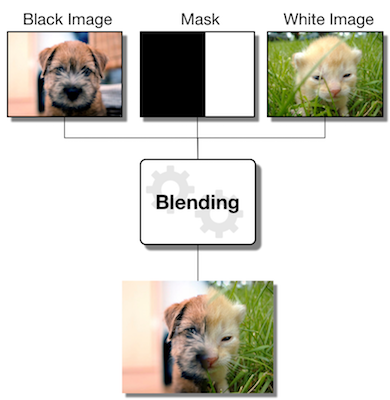

# Pyramid Blending

## Synopsis

In this assignment, you will be putting together a pyramid blending pipeline that will allow you to combine separate images into a seamlessly blended image. The technique is based on the Burt & Adelson paper *A Multiresolution Spline With Application to Image Mosaics*. You are required to use your own unique images and design a custom mask that best supports your image blend.

To help you with this assignment, you should carefully read the two required technical papers, and watch the associated modules:
  - [“The Laplacian Pyramid as a Compact Image Code"](http://persci.mit.edu/pub_pdfs/pyramid83.pdf) (Burt and Adelson; 1983)
  - [“A Multiresolution Spline With Application to Image Mosaics”](http://persci.mit.edu/pub_pdfs/spline83.pdf) (Burt and Adelson; 1983)
  - Module 04-01: Fourier Transforms
  - Module 04-02: Blending
  - Module 04-03: Pyramids
  - Module 04-04: Cuts
 

## General Instructions

- Images in the `images/source/sample` directory are provided for testing -- *do not use these images in your report*.

- The blending procedure splits the input images into their blue, green, and red channels and blends each channel separately. You do not have to worry about dealing with three channels; you can assume your functions take in grayscale images.

- You can execute the code that you write in `blending.py` by running `python main.py`. The script will look inside each subfolder under `images/source`, looking for folders that have images with filenames that **end** with 'white', 'black' and 'mask'. For each such folder it finds, it will apply the blending procedure to them, and save the output to a folder with the same name as the input in `images/output/`. For example, `images/source/sample` will produce output in `images/output/sample`.

- You may edit `main.py` as you wish to help you complete and troubleshoot your code. You will NOT submit `main.py`, it is only here to aid you in completing this assignment.

- Along with the output blended image, `main.py` will create visualizations of the Gaussian and Laplacian pyramids for the blend. You may use or refer to these to answer questions in your report, in which case, please add them to the report in the Appendix. However, they are not required.

### 1. Implement the functions in the `blending.py` file.
  - `returnYourName`: return your Gradescope official name 
  - `reduce_layer`: Blur and subsample an input image
  - `expand_layer`: Upsample and blur an input image
  - `gaussPyramid`: Construct a gaussian pyramid from the image by repeatedly reducing the input
  - `laplPyramid`: Construct a laplacian pyramid by taking the difference between gaussian layers
  - `blend`: Combine two laplacian pyramids through a weighted sum
  - `collapse`: Flatten a blended pyramid into a final image

The docstrings of each function contains instructions, so read them carefully. **You CANNOT use cv2.pyrUp or cv2.pyrDown anywhere in this assignment.** You have a limited number of submissions for each project, so you are *strongly* encouraged to write your own unit tests. **Do *NOT* try to use the autograder as your test suite.** The `test_blending.py` file is provided to get you started. Your code will be evaluated on input and output type (e.g., uint8, float, etc.), array shape, and values. Be careful regarding arithmetic overflow!

Now that you have seen and passed returnYourName in A0, we are going to change the scoring on it. The function will not count for any points, but failing to provide a correct name will result in a deduction (-5 points). It remains easy to tell what name Gradescope expects, the error text will tell you the expected name string (note that the expected output is case sensitive, make sure it matches your Gradescope name exactly).

When you are ready to submit your code, you can submit it to the Gradescope autograder for scoring, but we will enforce the following penalty for the submissions:

- <= 20 submissions: No penalty 
- <= 30 but >20 submissions: -5 penalty
- <= 40 but >30 submissions: -10 penalty
- more than 40 submissions: -20 penalty

### 2. Generate your own blended images using ORIGINAL inputs

You are REQUIRED to take and create your OWN images that are suitable for blending - you will need an ORIGINAL "black" and "white" image to combine, and an ORIGINAL mask. The black and white images should retain EXIF for exposure, aperture and ISO, at a minimum.  

Your images do not need to be large. We recommend that you keep each black and white image around 1 MB so that your code will not take forever to run, and so that your report and resources will stay under the size limit (see submission sections). You can use larger images, but they will be slow.

#### Masks

Create your own custom, non-trivial, "mask" image that defines the regions to combine. Your mask MUST be UNIQUE and should show that you have put thought into it. UNIQUE here means that you created the mask yourself. Do NOT submit a mask that you found online. Do NOT use the same or similar mask like the one we provided, in other words, simple masks such as masks that are split horizontally or vertically, or masks that are basic geometric shapes (ex: circle or oval), are not acceptable.  Do NOT create a mask that you think looks cool (e.g. checkerboard), but it makes no sense with your images because you will be penalized. We expect the mask to relate to the images WELL. Run your images through the pipeline and include the results in your report. 

You may use photo editing software to design your mask, and only your mask. Example programs are Gimp (open source, free), Photoshop, or many others. In the report, you will be asked to discuss the steps that you took to create your mask, so if you used software, make note of the steps you took and take screenshots if necessary. 

If you implement your own code to create your mask, you must discuss your implementation in your report.

The remainder of this project must be done by you using your python functions, and NOT using any software. 

### 3. Complete the LaTex Report

Use the `A2-Pyramid_Blending_template.zip` report template provided in the class repository. **The LaTeX template specifies all of the images, data, and questions you must answer.** Follow the instructions in the [Course Setup](https://github.gatech.edu/omscs6475/assignments/tree/master/Course_Setup) to upload it in Overleaf. If you have a different favorite LaTeX program, you may use it; the template should be generally compatible.
   
  - **The total size of your report+resources must be less than 20MB** for this project. If your submission is too large, you can reduce the scale of your images or report. You may resize your images using `cv2.resize`. You can compress your report using [Smallpdf](https://smallpdf.com/compress-pdf).
  - **The total length of your report is 5 pages maximum.** This report is expected to be four pages for most students, unless you decide to submit extra observations and images in the appendix (no extra credit, but the TA staff enjoys interesting work!)
  - **You are required to use the LaTex format for your report.** Different report organization or changing section titles and questions will receive a deduction. You may add additional relevant information or images within the structure of the report, as long as all requirements are met.
  - **You are required to provide References.** Everyone is expected to have at least two references; these should include StackOverflow answers that you relied on for specific commands, valuable tutorials, blogs, helpful Ed posts, and textbook references. Provide URLs and site or page names, typical book information and page numbers, etc. We should be able to easily view your references if needed.
   
**Save your report as `report.pdf`**

### 4. Submit the Report on Gradescope AND Canvas

1. **Gradescope:** Submit your Report PDF to **A2-Pyramid Blending Report.** Once it is uploaded, you may look through the pages to make sure you uploaded the right document and all parts are displayed properly. There is no limit to Report submission attempts, only Resources attempts. After you upload your PDF, you will be taken to the "Assign Questions and Pages" section that has a Question Outline on the left hand side. These outline items are determined by the Instructors. **For each question - select the question, and then select ALL pages that go with that question.** This is important because any pages that you do not select for the corresponding question might get missed during grading.

2. **Canvas:** submit your Report PDF on **Canvas > Assignments > A2-Pyramid Blending Report.** This allows your report to be uploaded to the Peer Feedback system. Forgetting to submit to Canvas by the late deadline will result in a deduction. 

### 5. Submit the Code and Images to Gradescope 

Create an archive named `resources.zip` containing your `blending.py` python file, images (black, white, mask, result) and any additional files/images you want to submit. Your images must be one of the following types: jpg, jpeg, or png.

Your files in `resources.zip` must be named as follows ('jpg' can be replaced by any of the other permitted extensions):
   - `blending.py` - Python file
   - `black_0.jpg` - Black image
   - `white_0.jpg` - White image
   - `mask_0.jpg` - Mask
   - `result_0.jpg` - Final blended image

In case you have more than one image for a particular type, for example, if you have two masks, name them as `mask_0.jpg` and `mask_1.jpg` and so on.

When you are zipping up your files, make sure that you zip only the files, and not the folder containing them. Gradescope looks at the root of the zip archive for the submitted files, so keep this in mind to avoid submission issues. Submit your zip to **A2-Pyramid Blending Resources** on Gradescope. 

The autograder will test `blending.py` and it will also check that you submitted the four image files with the correct names and acceptable file extensions (e.g. `black_0.jpg`, `white_0.jpg`). For the images, the autograder only checks that you submitted the required image files with the correct name and an acceptable extension. The Instructors will manually check all resources for correctness/quality during grading and will deduct points as necessary. Your code must run in less than 10 minutes on the autograder.

**Notes:**

  - Your final Resources submission must include all of the files listed in section 5. Gradescope does not keep track of files submitted earlier, and if your submission is incomplete, you cannot add any additional files after the due dates. 
  
  - **EXIF metadata:** When including or sharing images, make sure there are no data contained in the EXIF metadata that you do not want shared (i.e. GPS). If there is, make sure you strip it out before submitting your work or sharing your photos with others. Normally, we require that your images include aperture, shutter speed, and ISO. You may use `pypi/exif` library in a separate python file to strip GPS data if you wish.  Make sure you do not use an app that strips all exif from the image. 

  - **DO NOT USE 7zip.** We've had problems in the past with 7z archives, so please don't use them unless you don't mind getting a zero on the assignment.
  
  - **Note for All users:** If you zip your files, do it from within the folder by selecting the files.  Do not zip the directory.  The the additional file structure will prevent Gradescope from identifying your files.

  - **TAs tip:** Read the technical papers very carefully. The answers to almost every question are there.

## Criteria for Evaluation

Your submission will be graded based on:

  - Correctness of required code
  - Creativity & overall quality of results
  - Completeness and quality of report
