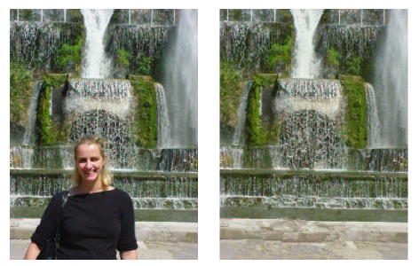
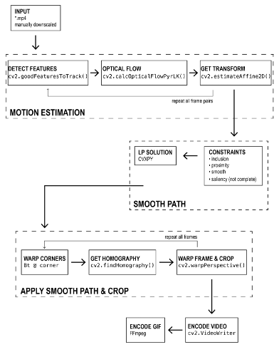

# Project 1: Object Removal

## Synopsis

The goal of this project is to replicate the results of a published Computational Photography research paper by following the methods described in the paper. **For this project, you will implement your own code to accomplish object removal.** Object removal remains a growing area with many new methods and papers emerging every year. Google's Magic Eraser is a good example of an object removal function that was released just last year. The research paper covered in this project is much simpler, but at the time it was written, it helped to generate several improvements in the object removal process.

Replication provides a deeper understanding of the research process and results. While previous results are helpful as a guide towards implementation, successful replication is challenging. The instructions from the published paper are not always clear and implementation details may be missing or ambiguous, which makes it difficult or impossible to achieve exactly the same results.

You will reach this goal by working through a research paper in the face of uncertainty. It is up to you to read and interpret the paper yourself (do not depend on others to do it for you). Where the description is imperfect, you will need to make assumptions and experiment to find an implementation that produces results that you find acceptable. We do not expect results to match exactly, but it is possible to come very close. You may have high level discussions with your classmates on Ed about the project, but do **NOT** share code.

All of the instructors for CS6475 want you to succeed in this course, which includes observing a level of honesty, integrity, and excellence befitting a graduate student of the Georgia Institute of Technology. This project and the challenges that come with it are representative of the kind of work done at the graduate level by researchers the world over. It is important to embrace the experience of making and clearly stating assumptions that allow you to move forward in the face of ambiguity, and documenting that process.

Make sure that you read the entire README, the research paper, and the LaTeX template before beginning to code in the provided python skeleton so you will not be surprised by requirements.

## Caution

&#x1F534; **Please remember that you may not use any part of this algorithm or code from another source in print, online, or in
 person (not from anywhere!).**  

&#x1F534; Every semester there are students who attempt to sneak plagiarised code past our TAs and automated systems. From the [Course Policies, Section I](https://omscs6475.cc.gatech.edu/course-syllabus/): *"Please note that Academic Integrity is taken very seriously here at Georgia Tech. Failure to uphold the honor code has severe consequences, including but not limited to receiving a “fail” grade on the assignment/project and severe disciplinary action from the Office of Student Integrity. We will continue to watch for instances unworthy of any student and hope that students follow both class and institute policy."*

## Instructions
You are required to write your own code that will produce results equivalent to those in the following paper:

- Criminisi, A., Perez, P., & Toyama, K. (2004). [Region Filling and Object Removal by Exemplar-Based Image Inpainting](https://www.microsoft.com/en-us/research/wp-content/uploads/2016/02/criminisi_tip2004.pdf). *IEEE Transactions on Image Processing*, 13(9). 

## What will be evaluated?

### 1. Completion of the Project

Develop a **working** implementation of object removal using the exemplar-based inpainting algorithm from the paper. You will be required to:
- Take your own pictures for use in this project
- Create your own mask images for the target regions
- Implement your own working code
- Create a computational pipeline flowchart
- Complete a final LaTex report 

**Scope Change** - If you are unable to complete the original scope of the paper and need to decrease the scope in order to complete the project, then make sure that you discuss the scope change in your report. You will lose points for reduced scope, but it is much better to have a reduced project with an intermediate output rather than just a proposed pipeline.

### 2. Creating Your Own Image Sets
 
 **You are required to generate at least three sets of ORIGINAL input and ouput results.** The quality of your final results are taken into consideration during grading, so make sure that your top three sets are your BEST top three. Each image set must include:
 - One original input image taken by you.
 - A mask you made for the object you are removing from your original input image.
 - A final result generated by your own working code.
 
 Optional: If you have additional sets (whether good or bad) that you want to share and discuss that do not fit in other sections of your report, you may use the Appendix. 
 

#### Image Basic Requirements:
- **Images must be 3-channel RGB color in `.jpg` or `.png` formats only.** The autograder will not accept any other formats.

- **Images must not exceed 1MB in pixel-size (height x width). NOTE: this is not the size that is listed under image properties; those are compressed sizes and may be a small fraction of the pixel-size.** Images of 200KB to 500KB pixel-size will work well and will process even quicker. Images over 1MB will have a deduction. This requirement will help ensure reasonable runtimes for code, as all of your image sets will be run using your code for verification.

- **Each input image must have its basic EXIF metadata.** Make sure that you keep the image's exposure time, aperture, and ISO. When including or sharing images, make sure there are no data contained in the EXIF metadata that you do not want shared (i.e. GPS). If there is, make sure you strip it out before submitting your work or sharing your photos with others. You may use the [piexif library](https://pypi.org/project/piexif/) in a separate python file to work with exif data. Make sure that you do not use an app that strips all EXIF metadata from the image. See [Ed #135.](https://edstem.org/us/courses/17654/discussion/1061976?answer=2423884)

#### Image Content Requirements:
- Each image must have a non-trivial object removed (e.g. people or other significant objects in the image). The object(s) you choose to remove _cannot_ be simple textured areas. Large objects that approach 10% of the pixel-size may be difficult subjects.

- Geometric images, such as Figure 7 and Figure 13 in the paper, are **not allowed** to be included in lieu of original images that you took with a camera. You may experiment with geometric images during your development and include your results and observations as extra material in your report, but again, it will not be considered as part of the required image sets. 

#### Mask Requirements:

- The mask is a single channel black & white image with a range of (0, 255). You may convert your mask to other range types in your code if you wish.

- Mask requirements are similar to *Assignment 2 - Pyramid Blending*.  For each set, you are required to create your own custom, non-trivial, black & white "mask" image that defines the regions you want to remove. Do NOT submit a mask that you found online and avoid creating simple/trivial masks. You may start with a simple set for your own testing purposes, but you should present at least three non-trivial sets in your final submission.

- You may use photo editing software to design your mask. Example programs are Gimp (open source, free), Photoshop, or many others. In the report, you will be asked to discuss the steps that you took to create your mask, so if you used software, make note of the steps you took and take screenshots if necessary. 

- If you implement your own code to create your mask, you must discuss your implementation in your report.

- You CANNOT use outside software for any other parts of this project. 

### 3. Original Source Code

**You are expected to write YOUR OWN code as part of your project,** and explain it in the report. You **MAY NOT** use any existing implementations of any algorithms as a starting point. You must write your own implementation following the algorithm(s) presented in the paper. *Including any part of the algorithm or code from any other source is forbidden and will be treated as plagiarism and an honor code violation. This includes porting an existing implementation between languages.* **Citing such a source does not remove the violation.**

- **All of your code must be in `object_removal.py`.**  A skeleton is provided for you so that your function signatures and returns will work in the autograder. The TAs will run your code with your own image sets to verify your result images. **Your submission must include all source code necessary to produce your results. We cannot stress this enough - make sure that the results that you present in your report are generated by running your submitted code with your submitted input images. If our results from running your submitted code/images do not match up with the results you present, we will investigate and there may be substantial deductions.**

- **Your image sets are numbered 1, 2, and 3.** Zero is saved for use by the autograder.

- **Watch for function variable `setnum`** that you may use to cue variations in your code for your three images. Window size is a critical input that you may need to vary for best results in your your image sets (`setnum=1,2,3`). We are reserving `setnum=0` for use by the autograder. We will be using little images/masks with small window values in the autograder. Your code will take far less time to run. Hard-coding the inputs could cause your code to fail. 

#### Class Environment & Libraries:

- **You must use Python, and begin with the class environment, CS6475.** Make sure that you use the `cs6475.yml` that we provided in the [course repository](https://github.gatech.edu/omscs6475/assignments/blob/main/cs6475.yml). Using different versions of python or different versions of any of the other specified libraries may result in code crashes when we verify your code and images. You may check your env installation by running `pip freeze > requirements.txt` in your code environment.  If you have loaded other libraries, we cannot guarantee that your environment is OK. Dependencies are often updated when libraries are uploaded.

- **The basic set of permitted libraries are listed in the import section of `object_removal.py`. You may NOT import any additional libraries in your code**; this causes the autograder to stop with no score and an error report. It counts as a submission.

- **Forbidden library functions in OpenCV are those associated with inpainting.** There is further guidance in `object_removal.py`. **You may not use functions that do the majority of the work for you.** The presence of these functions will result in significant deductions and will be reviewed for further action, up to a honor code violation for substantial usage.
  
  
#### Performance Tips 

  - **Your report requires presentation of interim results and failures.** Keep some images aside in a folder for this!
  
  - **A `main.py` file is included that will generate all of the required images from your code** in `object_removal.py`.  You are not required to use it, but it follows the function call syntax that we will use in the autograder and in our automated full-code run with image production. You may revise it, but it would be a good idea to keep a clean version around to check your code before submissions.
    
  - **It is critical to start with small toy images while you develop your methods.** Location record-keeping for the object being removed is fundamentally important, it may be easier to develop this with pencil and paper. 
  - You can iterate and test faster by making reduced size copies of your input images to test your code, but your final results must be generated using full size images.

  - You may use cv2 and numpy generic border/contour, masking, matching, and filtering methods, and many other single functions. If there is any doubt about using a function, please use a public post on Ed to ask about it so that everyone in the class is aware of yes/no verdicts for code.
      
  - Python with good profiling/optimization will be reasonably fast on the given images. Vectorize your Python code wherever possible for efficient array operations as long as they do not directly implement the algorithm(s). 
  
  - Consider writing intermediate and final result matrices to disk for manual inspection or iterative development to save time. Consider adding pre-allocated buffers and assigning to them with np.copy when possible. This avoids unnecessary heap allocation/deallocations that could significantly slow down processing, depending on how badly the heap is fragmented.

  - You may use code and image handling methods from the previous assignments. 
  
  - **There are time limits** - see [Autograder Information and Code Runtime Limits](#autograder-information-and-code-runtime-limits). If your laptop/ordinary desktop can produce the result images within the 2 hour time limit, then your code should be fast enough. Last term, the mean run time for all 3 images was 20 min, median was 6 minutes.

### 4. Computational Pipeline & Code Explanation

Provide a complete computational pipeline of your project:

- For each step, name the function(s) or algorithm(s) used.
- Include any steps completed with outside packages/code with a note.
- Indicate which steps are manual (i.e. not a part of your automatic pipeline).
- Include any incomplete step(s) with a note that says 'not completed'.

The flowchart is shown here and in the report template as an example. This section holds the single flowchart image along with text explaining your process. [Draw.io](https://app.diagrams.net/) is one free software tool to generate flowcharts, or you may use others you are familiar with. 

Clearly explain the purpose of each flowchart step, and explain how your code accomplishes it. Do NOT re-explain the algorithm here! In the text explanation, show pseudocode or a SHORT (2-5 lines) snippet of critical code that accomplishes that pipeline step and EXPLAIN the code.

### 5. Required Report Sections

You must use the provided LaTeX template `Project1_Object_Removal.zip`. There is a page limit for each section, so make sure to read the LaTeX template. **Your report must be 10 pages or less.**  Make sure to provide a detailed discussion in each of the required sections.
 
Here is a summary of what each section will cover. There are more detailed directions for each section in the LaTeX template, so again, make sure to carefully read the template. 

#### SECTION 1:
- **Project Goals**: Discussion of the original scope and any scope changes.
 
#### SECTION 2: 
- **Algorithm Discussion**: Explain the major algorithm from the paper. Show that you understand this in your OWN words. Do NOT copy from the technical paper. 

#### SECTION 3: 
- **Computational Pipeline & Code:** Present your computational pipeline flowchart and explanation of each step.
 
#### SECTION 4: 
- **Project Development**: A detailed narrative of your development process that includes:
    - **Problems & Issues** you faced along the way, and how you resolved them. Includes the **presentation of good and failed interim results** (from various parts of your work and pipeline). **Keep some of your early work images in a folder for this purpose!**
   - **Retrospective** discussion of what you would do differently. This can cover any part of your project, but make sure to explain the issue, and specifics on what you would investigate or do differently.

 #### SECTION 5:
- **Image Sets Results & Discussion**: At least 3 original image sets are required. Each set consists of an input, mask and result. Provide good discussion of each image of the set. 

 #### REFERENCES: 
 - Include all critical resources. We expect to see relevant links to code resources and research.  There should be **at least 3** meaningful references.
 
 #### APPENDIX:
 - This is optional and part of the 10 page limit. You may include any additional images/image sets you want to share.

## Project Submission

**The total size of your report and resources must be less than 30MB for this project.** Even though there are many images for Resources, they should all be smaller than the images pixel-size limit. Student reports with all type `.png` images inserted are usualy around 5MB, and the accompanying Resources images will be under 1MB each. This should be an easy requirement to meet. If your submission is too large, you can compress your report using [Smallpdf](https://smallpdf.com/compress-pdf) or other programs.

Do not resize your image sets after the results are generated! Remember, we are running your code and images, and we should get similar results.

#### 1. Submit the REPORT on Gradescope and Canvas

Save your LaTeX report as a file named `report.pdf` and submit the SAME file to TWO locations:

 - **Gradescope**: Submit your report PDF under **Project 1 Report.**  Once it is uploaded, you may look through the pages to make sure you uploaded the right document and all parts are displayed properly. There is no limit to Report submission attempts, only Resources attempts. After you upload your PDF, you will be taken to the "Assign Questions and Pages" section that has a Question Outline on the left hand side. These outline items are determined by the Instructors. **For each question - select the question, and then select ALL pages that go with that question.** 
 
 - **Canvas**: Submit your report PDF under **Project 1**. In order for your report to be included in Peer Feedback, you MUST submit it on Canvas before the late deadline. There is a minor deduction for not submitting your PDF on Canvas.

Keep in mind, **the Instructors will ONLY grade the GRADESCOPE report submission. This is considered the official report submission, NOT the Canvas PDF submission.**

#### 2. Submit the RESOURCES on Gradescope

Gather all of the resources files together and then zip them together in an archive named `resources.zip` containing: 

A. **Project source code (1):** 
  - Only `object_removal.py` is required. No other python files should be submitted.

B. **Required images (10):** 
  - These images should be included in your report too - three original result sets plus your flowchart. All of your required images should be `.jpg` or `.png`. Other image types do not do well in the LaTeX report. 
1. `input_1.png` - First input image taken by you
2. `input_2.png` - Second input image taken by you
3. `input_3.png` - Third input image taken by you
4. `mask_1.png` - First original mask image created by you
5. `mask_2.png` - Second original mask image created by you
6. `mask_3.png` - Third original mask image created by you
7. `result_1.png` - First original result image generated from your code.
8. `result_2.png` - Second original result image generated from your code.
9. `result_3.png` - Third original result image generated from your code.
10. `flowchart.png` - Your computational pipeline flowchart.

C. **Additional files:**  
Submission of all images and/or visuals is a requirement. If you have more than three result sets, you may name them `input_4.png`, `mask_4.png`, `result_4.png`, etc. **Any result images/visuals** that you include in your report MUST also be included in **`resources.zip`.** Use descriptive filenames.

**NOTE: DO NOT USE 7zip.** We've had problems in the past with 7z archives, so please don't use them unless you don't mind getting a zero on the project.

**IMPORTANT NOTE: If you do not submit any code, that will be an automatic zero on the project. If you submit a non-working code file, there will be a significant point deduction.**

## Autograder Information and Code Runtime Limits

#### Autograder Information:
 
The autograder will check that you submitted 10 correctly named images files. If you submitted these files and named them correctly, you will see a score of 10 points, and see the feedback note "You have submitted all of the required files."  If these images are missing, deductions are taken in the report.

Additionally, the autograder will run your `object_removal.py` code and test your results, for a further score of 15 points.  The AG will check only that your function returns result images with the correct dimensions and type for each of the test sets. 

- **The Resources points are NOT an official part of the grade for this project.** If you submit the required images and pass the function calls, you will see a total score of 25 points.  The autograder does not verify that your code produces the appropriate results, only that it produces something.

- **We are setting a limit of 30 submission attempts with no score deduction.** (31-40 attempts is -10 points, 41+ attempts is -20 points). Your code can be easily tested with `main.py`, so no one should come close to this limit.

**In summary, the autograder for this project is not an official score. The autograder lets you and the grading TAs know that you submitted all of the files, your code runs, and it returns arrays of the right type and dimensions. The autograder is NOT grading your image or code quality.** 

#### Code Run Time Limits & Deductions:

**The code autograder runtime limit is 20 minutes.** Even if your code takes longer on your computer, it will be much faster on the Gradescope test sets. We will pass in very small image/mask pairs (under 5kB images) with specific window dimensions. Our goal is to determine that your code provides result images. Make sure you do not hard code image dimensions, 'setnum=0', or window dimensions!  The autograder code check is for your benefit and does not count against you. 

&#x1F534; **We will run your source code against your 3 provided input image/mask pairs as part of the grading and evaluation process.** This is the critical code evaluation. The code runtime limit for this execution is **2 Hours**. Note that this is **not** the same time limit given for the Gradescope execution. On average, last term student code took under 20 minutes using all three image sets, so allowing 2 hours is generous. We capture each result image immediately after it is produced. If your code runs for longer than 2 hours with no results, we will stop it. For these cases, we will put in additional effort to get your code to work, but it does come with additional deductions:
 - We will try again, providing 4 hours to try running your code with your own images. For each hour or portion of an hour that your code is running over 2 hours, there will be a 5 point deduction.
 - If your code takes longer than 4 hours, we will substitute your images with our own small simple set to see if your code works at all. If we have to do this, there will be an additional 10 point deduction.
 - Code that crashes in the initial 2 hour run usually crashes within a few seconds. We record the crash data and will contact you. These may be silent opencv/numpy errors, or the result of environment problems. If we attempt to get your code to run, deductions may be 10 or more points.
 - If we cannot resolve why your code does not run or produce results as shown in the report, penalties range from 50% deduction to zero on the project, depending on the investigation results.
 

## Evaluation Criteria

Your work will be graded on:

  - Meeting the specified requirements for the code and report.
  - Your understanding and communication of the algorithms and results from 
    the original paper.
  - Use of appropriate images/masks that you took/produced yourself
  - The quality of your object_removal results.
  - The quality and level of analysis provided in your report.
