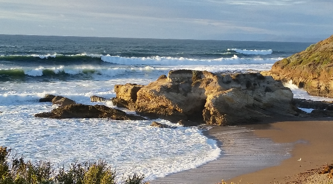
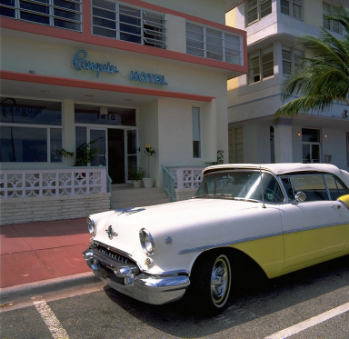

# Project 2: Seam Carving

## Synopsis

The goal of this project is to replicate the results of published 
Computational Photography papers by following the methods described in the 
papers. For this project, you will implement your own code to accomplish 
seam carving.

Take a look to see results of forward and backward seam carving: [Seam Carving Results](https://faculty.idc.ac.il/arik/SCWeb/vidret/results/image_results.html)  

Replication provides a deeper understanding of research results, and allows you to compare your results against an expected baseline. While previous results are helpful as a guide towards implementation, successful replication is challenging. Instructions are not always clear and implementation details may be missing or ambiguous, which makes it difficult or impossible to achieve exactly the same results.

You will reach this goal by  working through two related research papers in the face of uncertainty. To that end, the TAs will only answer logistical questions about this project; they will not answer questions about the research papers or the algorithm itself. It is up to you to read and interpret the paper yourself (do not depend on others to do it for you). Where the description is imperfect, you will need to make assumptions and experiment to find an implementation that produces results that you find acceptable. We do not expect results to match exactly, but it is possible to come very close. You may have high level discussions with your classmates on Ed about the project, but do **NOT** share code.

&#x1F534; **Please remember that you may not use any part of this algorithm or code from another source in print, online or in
 person (not from anywhere!).**  Make sure that you read the entire README 
and the LaTeX template before beginning to code in the provided python skeleton so you will not be surprised by requirements.

&#x1F534; This bears repeating, as every semester there are occasionally students who, for one reason or another, believe they can sneak plagiarised code past our automated systems and TAs. From the [Course Syllabus, Section I](https://omscs6475.cc.gatech.edu/course-syllabus/): *"Please note that Academic Integrity is taken very seriously here at Georgia Tech. Failure to uphold the honor code has severe consequences, including but not limited to receiving a “fail” grade on the assignment and severe disciplinary action from the Office of Student Integrity. We will continue to watch for instances unworthy of any student and hope that students follow both class and institute policy."*

&#x1F534; All of the instructors for CS6475 want you to succeed in this course, which includes observing a level of honesty, integrity, and excellence befitting a graduate student of the Georgia Institute of Technology. This project, and the challenges that come with it, are representative of the kind of work done at the graduate level by researchers the world over. It is important to embrace the experience of making and clearly stating assumptions that allow you to move forward in the face of ambiguity, and documenting that process.

Historically, students have reported spending _much_ more time on this project than any of the other projects in the term. Fine-tuning results can take significantly more time than getting a basic version of the algorithm working. Although speed is not an important part of the project, your code will need to complete running in the autograder in a generous, but limited time. You will find that vectorizing your solution is critical to complete the project, and it will also help you debug faster.

## Instructions

You are required to write your own code that will produce results equivalent to 
those in the following two papers:

- Shai Avidan, Ariel Shamir. [Seam Carving for Content-Aware Image Resizing](http://www.faculty.idc.ac.il/arik/SCWeb/imret/index.html). (2007)
- Micheal Rubinstein, Ariel Shamir, Shai Avidan. [Improved Seam Carving for 
  Video Retargeting](http://www.faculty.idc.ac.il/arik/SCWeb/vidret/index.html). (2008)   **You are using methods from this paper for static images, 
  not video.**

_NOTE:  The above websites of the principle writers contain
 images and results, videos, presentation powerpoints, and high resolution copies of the papers that you may
  use to better understand the project._

### 1. Required Results

*You will deliver:*

  - Source code containing **your own** implementation of the **seam carving 
    algorithm** from the 2007 paper for both enlarging and reducing images. 
    **NOTE: this algorithm is referred to as "Backwards 
     Energy" in the 2008 paper. We will use the term 'backward' throughout 
     the 
     project to refer to this method.**

  - Source code containing **your own** implementation of the **Forward Energy** improvement in the 2008 paper for both enlarging and reducing static images (no video).
    
  - Visual and numerical evaluations of your result images against provided comparison images.
  
  - A written Latex report **(see Section 3)** that covers the Report Requirements.
  - The great majority of credit in this project is awarded for 
the 
quality of your images and the quality of your metrics analysis. We will 
    verify that your code produces your results.

*Provided Images:* 

 
 
 

 

 

You are supplied with four small base images and ten corresponding 
comparison images in the images folder. The four base images are `beach.png`, 
`dolphin.png`, `bench.png` and `car.png`. The ten comparison images that you 
will produce are described below, with the required name for your result images.

*You will reproduce the following results:*
  - Use your own code implementation of the algorithms to generate results.
  - All image reduction for these algorithms will be for **vertical seams 
  only**. We are not working with horizontal seams.
  - **The number of seam insertions or removals for each image is given in the table. We are NOT using percentage values.** 
  - There are 10 result images.
  - There are 7 difference comparison images; the associated result images all require a full comparison analysis.
  - Remember to perform difference calculations using floating point variables, otherwise your difference images and metrics may return clipped, wrapped, or truncated (and therefore inaccurate!) results.
  - The 3 red-seam result images will NOT have difference images or metrics analysis. 
  - All result and difference images are formatted as`.png` 
     
     
| Paper and Instruction |Base (_.png_)| Comparisons Provided      (_.png_) |Result & Difference Images (_.png_)  |
|:---------------------------------------------------------|:------------:|:--------------|:---------------|
| (2007) Similar to Fig 5: Backwards seam removal of **300 seams** | `beach`| `comp_beach_back_rem` | `res_beach_back_rem` `diff_beach_back_rem` | 
| (2007) Reproduce Fig 8c: Backwards seam insertion of **100 seams**, show the seams added in **red** | `dolphin` | `comp_dolphin_back_ins_red` |  `res_dolphin_back_ins_red` 
| (2007) Reproduce Fig 8d: Backwards seam insertion of **100 seams** | `dolphin` | `comp_dolphin_back_ins` | `res_dolphin_back_ins` `diff_dolphin_back_ins` |
| (2007) Reproduce Fig 8f: Backwards seam **two** insertions of **100 seams** | `dolphin` | `comp_dolphin_back_double` | `res_dolphin_back_double` `diff_dolphin_back_double` |
| (2008) Fig. 8: Backwards seam removal of **225 seams** | `bench` | `comp_bench_back_rem` | `res_bench_back_rem` `diff_bench_back_rem` |
| (2008) Fig. 8: Backwards seam removal of **225 seams**, showing red seams removed on base image | `bench` | `comp_bench_back_rem_red` | `res_bench_back_rem_red`  |
| (2008) Fig. 8: Forwards seam removal of **225 seams** | `bench` | `comp_bench_for_rem` | `res_bench_for_rem` `diff_bench_for_rem` |
| (2008) Fig. 8: Forwards seam removal of **225 seams**, showing red seams removed on base image | `bench` | `comp_bench_for_rem_red` | `res_bench_for_rem_red` |
| (2008) Similar to Fig 9: Backwards seam insertion of **170 seams** | `car`| `comp_car_back_ins` |  `res_car_back_ins` `diff_car_back_ins` |
| (2008) Similar to Fig 9: Forwards seam insertion of **170 seams**| `car`| `comp_car_for_ins` |  `res_car_for_ins` `diff_car_for_ins` | 

Use only the base and comparison images that we provide in the images folder, with the seam insertion/removal values shown in the table. The autograder is programmed to look for these particular image dimensions. The images and seam values are slightly smaller than we have used in the past.  Do not expect your seams to match older work exactly, they won't.  However, the patterns of seams will be similar, as you can see from the comparison images we provide.

### 2. Code Requirements
 - You **MAY NOT** use any existing implementation of the seam carving 
   algorithm as a starting point. You must write **your own** implementation following the algorithms presented in the papers. *Including any part of the algorithm or code from any other source is forbidden and will be treated as plagiarism and an honor code violation.* **Citing such a source does not remove the violation.**

 - All of your code must be in `seam_carving.py`.  A skeleton is proved for you so that your function signatures and returns will work in the autograder. **Your submission must include all source code necessary to produce your results.**

 - You must use Python, and begin with the class environment, CS6475. The basic set of permitted libraries are listed in the import section of `seam_carving.py`. 

 - You may NOT import any additional libraries in your code; this causes the autograder to crash with no score and an error report. It counts as a submission.
  
 - Do not hard-code the optional inputs in the signatures. We will be using tiny images with small seam insertion and removal values in the autograder. Your code will take far less time to run. Hard-coding would cause your code to fail.
  
 - There is further guidance in `seam_carving.py` regarding forbidden library functions. **You may not use functions that find seams, calculate cost functions, perform graph cuts, or perform your numerical comparison calculations.** The presence of these function will result in significant deductions and be reviewed for further action, up to a honor code violation for substantial usage.

 - It is **EXTREMELY** important that your output images match what you submit in your report and resources. We will be running your code and comparing them against what you have submitted.

#### Performance Tips

  - **A `main.py` file is included that will generate all of the required images from your code** in `seam_carving.py`.  You are not required to use it, but it follows the function call syntax that we will use in the autograder and in our automated full-code run with image production. You may revise it, but it would be a good idea to keep a clean version around to check your code before submissions.
    
  - **It is critical to start with small toy images while you develop your methods.** Location record-keeping is fundamentally important, it may be easier to develop this 
      with pencil and paper.
      
  - Python with good profiling/optimization will be reasonably fast on the given images.
  
  - Consider writing intermediate and final result matrices to disk for manual inspection or iterative development to save time. 
   
  - Vectorize your Python code wherever possible for efficient array operations as long as they do not directly implement the seam carving algorithm or numerical comparison algorithms.  We will provide some general code hints on numpy/scipy usage on Ed. 
  
  - You can iterate and test faster by making reduced size copies of the input images to test your code, but your final results must be generated using the full size images provided in the git repository.

  - Consider adding pre-allocated buffers and assigning to them with np.copy when possible. This avoids unnecessary heap allocation/deallocations that could significantly slow down processing, depending on how badly the heap is fragmented.

  - You may use code and image handling methods from the previous assignments. 
  
  - There are time limits; see the Resource Requirements section. Most students have code running through all required image production in 5 to 45 minutes, which is much less than the limit.

### 3. Report Requirements 

- The report must be in LaTeX PDF format. **No other format will be accepted.**

- The report must be **6 pages or less.**  There is no additional appendix for this project.

- You are **REQUIRED** to follow the template included in this repository to write your report (see the template zip file). The template was designed in Overleaf. If you prefer a different LaTeX tool/program that works with our template, you may use it.

### 4. Required Report Sections
The numbering and section names provided in the template are used below. Do not change them. Guidelines for the amount you should write are provided in the template. 

I. **Discussion of Algorithms:** This should include an overview of your key implementation decisions and a description of the important functions that you used (e.g. cumulative minimum energy function).  *Just for planning, this section should take less than one page.*

II. **Comparison Metrics:** How similar is your result to our comparison image? **You will compare in two ways: with a visual difference image, and using a quantitative measurement (numerical calculation).**  The metrics are a big part of the comparison grade. You will make the actual comparisons in following sections.

- **Explain the method you used to generate your difference images.** How does this method make the small and large differences 
between the two images visible?  Don't let your method get too noisy, it should be clear from looking at the image where the differences are.

- Include one or two (and no more!) **strong** quantitative methods that you chose. Discuss the similarity or difference between each comparison image and your result. You should do a little research to determine what are good metrics, and not just choose the first one you see. Explain why your metric is appropriate. 

- **Include the basic mathematical equation** for your metric and identify its variables. In your code, make sure that you address all three channels of the image when you calculate your metric.

- Your chosen numerical metric results should allow comparison between unrelated sets of 
  images, e.g., were your results for the beach image better or worse than your results for the car? This implies that the number of pixels that is different in an image is not what is important; rather, produce the relative effect (often a percentage, or change per pixel). 

- Cite the sources you use to develop your metrics in the References section. 

III. **Replicated Images and Comparison of Results:** There are four subsections covering the four base images (beach, dolphin, bench, and car). The table on [Required Results](#1-required-results) describes the 17 result images you must include in your report and resources. Ten seam-carving images will be produced, along with seven difference images to support visual analysis. The red-seam images will not have difference images or calculations.
 
- You will present and compare your result images to the comparison images. Your result images should closely resemble the results shown in the papers. We do NOT expect your results to be a 100% match. Present your metric results in a short table.

- Remember to create your difference images and numeric metrics using floating point variables, otherwise your differences data may return truncated (and therefore inaccurate!) results.

- Discuss the differences between your results and the comparison images in three ways - First, what differences are visible to a person looking at the two images. Second, where does your difference image indicate that your results are differ. What causes the difference? Third, quantify the difference using a numerical method that produces a single result. What do the measures tell you? How is that related to your methods and decisions? This guidance is in the LaTex template.

- Analyze the differences and identify reasons that your results differ.

&#x1F534; **DO NOT INCLUDE RESULTS THAT DO NOT COME FROM YOUR OWN CODE. WE CHECK.** 
   
IV. **Ambiguities and Issues:**  A discussion of **at least three specific items** from the original research papers that made the results difficult to replicate (e.g., ambiguous instructions or descriptions, unclear assumptions, etc.) and explain how you overcame each.

V. **References:** Remember to cite your sources! The References section must fit within the allowed pages. If you cite web links for sources, make sure that links are clickable. Significant code references should be included. We expect all students to have at least two references in addition to the source papers references.

**Important Note:** Make sure your report meets the [report length requirements.](#3-report-requirements) A report of *one* line over will cost you points. Edit well.

## Submit the Project

**The total size of your report and resources must be less than 20MB for this project.** Even though there are many images for Resources, they are small. Student reports with all  type `.png `images inserted are usualy under 5MB, and the accompanying Resources are also about 5MB. This should be an easy requirement to meet. If your submission is too large, you can compress your report using [Smallpdf](https://smallpdf.com/compress-pdf) or other programs.

### 1. Submit the Report on Gradescope and Canvas

Save your LaTeX report as a file named `report.pdf` and submit the SAME file to TWO locations:
 - **Project 2 Report on GRADESCOPE**; the Instructors will only grade the GRADESCOPE report submission (considered official).  
 - **Project 2 on Canvas**;  in order for your report to be included in Peer Feedback, you MUST submit it on Canvas before the late deadline. 

**Gradescope:** Submit your Report PDF to **Project 2 Report.** Once it is uploaded, you may look through the pages to make sure you uploaded the right document and all parts are displayed properly. There is no limit to Report submission attempts, only Resources attempts. After you upload your PDF, you will be taken to the "Assign Questions and Pages" section that has a Question Outline on the left hand side. These outline items are determined by the Instructors. **For each question - select the question, and then select ALL pages that go with that question.** This is important because any pages that you do not select for the corresponding question might get missed during grading.

There may be multiple pages per item. For example, if your section "Replicated Images and Comparison of Results" starts on Page 2, and ends on Page 5, but there are some images for it on page 6, make sure to select pages 2, 3, 4, 5, and 6. 

### 2. Submit the Resources on Gradescope

Gather all of the resources files together and then zip them together in an archive named `resources.zip` containing: 

A. **Project source code (1):** 
  - Only `seam_carving.py` is required. No other python files should be submitted.

B. **Required images (17):** These are the ten required result images and 
seven required difference images generated from your code, and named as 
given in [Instructions, 1. Required Results](#1-required-results). All of 
your required images should be `.jpg` or `.png`. Other image types do not do 
well in the LaTeX report.

C. **Additional files:**  We pay attention to quality and reproduceability of results. Submission of all images and/or visuals is a requirement. **Any result images/visuals** that you include in your report MUST also be included in `resources.zip`. 

**NOTE: DO NOT USE 7zip.** We've had problems in the past with 7z archives, so please don't use them unless you don't mind getting a zero on the assignment.
  
  - If you have multiple results in the report for a figure for any reason, name them after the result image you are discussing. For example, for Figure 8 (2008), name them as`bench_back_rem_extra1.jpg`, `bench_for_rem_red_extra2.jpg`, etc.
  
 - *Note:* if you are including base images for discussion purposes, clearly identify them in the captions. These original images do NOT have to be included in the resources. 

&#x1F534; **We will run your source code against the base images (full resolution) as part of the grading and evaluation process.** The code runtime limit for this execution is **2 Hours**. Note that this is **not** the same time limit as is given for the Gradescope execution. See the section on Autograder Information below for the time limit for gradescope submissions, and the caveats as to why these two times are different.

During grading, we will manually check files you submitted to Resources. Additional deductions may apply if we find something wrong (ex: `seam_carving.py` does not return the same images that are in your report, or images were not submitted, etc.).

**IMPORTANT NOTE: If you do not submit any code, that will be an automatic zero on the project. If you submit a non-working code file, there will be a significant point deduction.**

#### Autograder Information:

The autograder will check that you submitted 17 correctly named images files. If you submitted these files and named them correctly, you will see a score of 17 points, and see the feedback note "You have submitted all of the required files." 

Additionally, the autograder will run your `seam_carving.py` code and test your ten results and the difference image function, for a further score of 11 points. We will pass in small images with various percentages of seams to be inserted or removed. The AG will check that your functions return result images have the correct dimensions and type for each of the ten results. The difference image generator will also be checked. The numerical metric function will be hand-checked, due to the variety of metrics students may choose.  These results are for your benefit, and will not count in the official report grade. The Auto grader will report test results only.

- **The Resources points are NOT an official part of the grade for this project.** If you submit all 17 required files and your code passes all 12 function calls, you will see a total score of 29 points.  The autograder does not verify that your code produces the appropriate seam carving results, only that it produces something.

- **The code autograder runtime limit is 20 minutes.** Even if your code takes longer on your computer, it will be much faster on the Gradescope instances, as we will be testing against very small images. Our goal is to determine that your code works. Make sure you do not hard code image dimensions or the number of seams!

- **We are setting a limit of 30 submission attempts with no score deduction.** Your code can be easily tested with `main.py`, so no one should come close to this limit.

**In summary, the autograder for this project is not an official score. The autograder lets you and the grading TAs know that you submitted all of the files, your code runs, and it returns arrays of the right type and dimensions. The autograder is NOT grading your image or code quality.** 

## Evaluation Criteria

Your work will be graded on:
  - Meeting the specified requirements for the code and report.
  - The quality and level of analysis provided in your report.
  - The quality of your replication results (images).
  - Your understanding and communication of the algorithms and results from 
    the original papers.
 
  

